# Prompt Engineering


## Table of Contents

- [Introduction](#introduction)
- [LLM Settings](#LLM-Settings)
- [Basics of Prompting](#Basics-of-Prompting)

   * [Prompting an LLM](#prompting-an-llm)
   * [Prompt Formatting](#prompt-formatting)

- [Prompt Elements](#Prompt-Elements)
- [General Tips for Designing Prompts](#General-Tips-for-Designing-Prompts)

  * [Be clear and specific](#be-specific-and-clear)
  * [Break down the task](#break-down-the-task)
  * [Use Input- output examples](#use-input-output-examples)
  * [Incorporate context and constraints](#incorporate-context-and-constraints)
  * [Discuss approaches and ask for user input](#discuss-approaches-and-ask-for-user-input)
  * [Handle Edge cases and errors](#handle-edge-cases-and-errors)
  * [Iterative Refinement](#iterative-refinement)
  
- [Techniques](#Techniques)

  * [Zero-shot Prompting](#Zero-shot-Prompting)
  * [Few-shot Prompting](#Few-shot-Prompting)
  * [Chain-of-Thought Prompting](#Chain-of-Thought-Prompting)
  * [Self-Consistency](#Self-Consistency)
  * [Tree of Thoughts](#Tree-of-Thoughts)
  * [Automatic Reasoning and Tool](#Automatic-Reasoning-and-Tool)
  * [Directional Stimulus/instructional Prompting](#Directional-Stimulus/instructional-Prompting)
  * [ReAct](#ReAct)
  * [ReBuff](#ReBuff)
  * [Multimodal CoT](#Multimodal-CoT)


### **Introduction**
------------

- Prompt engineering involves the systematic design, optimization, and refinement of prompts to effectively utilize language models (LMs) for various tasks and applications.
- It encompasses techniques for crafting precise, informative, and contextually appropriate prompts that guide LLMs to produce desired outputs efficiently and accurately.
- Prompt engineering aims to enhance the performance, robustness, and versatility of LLMs across different domains and use cases.
- Proficiency in prompt engineering aids in understanding the capabilities and limitations of large language models (LLMs).
- Researchers utilize prompt engineering to enhance LLMs' performance across a wide array of tasks, including question answering and arithmetic reasoning.
- Developers leverage prompt engineering techniques to design robust and efficient prompting methods that seamlessly interface with LLMs and other tools.

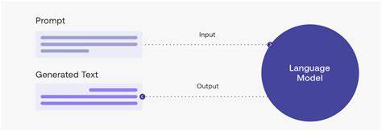

### **LLM Settings**
-------------
- "LLM settings" likely refers to "Large Language Model settings."

- These settings pertain to various parameters and techniques used when working with large language models like GPT-3 for prompt engineering.

**Let's explore some important LLM settings for effective prompt engineering:**

- **Temperature**: This parameter affects the randomness of the model's outputs. Lower values make the model more deterministic, while higher values introduce more randomness and diversity in responses. Lower temperatures are useful for fact-based tasks like question answering, while higher temperatures are suitable for creative tasks like poem generation.

- **Top_p**: This sampling technique, also known as nucleus sampling, controls the determinism of the model's responses. Lower values result in more confident and deterministic outputs, while higher values allow the model to consider a wider range of possibilities, leading to more diverse responses.

- **Max Length**: This setting determines the maximum number of tokens in the model's response. It helps prevent overly long or irrelevant outputs and allows for cost control.

- **Stop Sequences**: Stop sequences are strings that halt the model's token generation process. By specifying stop sequences, you can control the length and structure of the model's response. For example, you can limit the model to generate lists with a maximum number of items.

- **Frequency Penalty**: This penalty is applied to tokens based on their frequency in the response and prompt. Higher frequency penalties make repeated words less likely to appear in the model's output, reducing word repetition.

- **Presence Penalty**: Similar to frequency penalty, presence penalty penalizes repeated tokens, but the penalty is consistent for all repeated tokens. This setting discourages the model from repeating phrases too often in its responses. Adjusting presence penalty can promote diversity or focus in the model's output.

The general recommendation is to adjust temperature or top P, and either frequency penalty or presence penalty, but not both simultaneously.

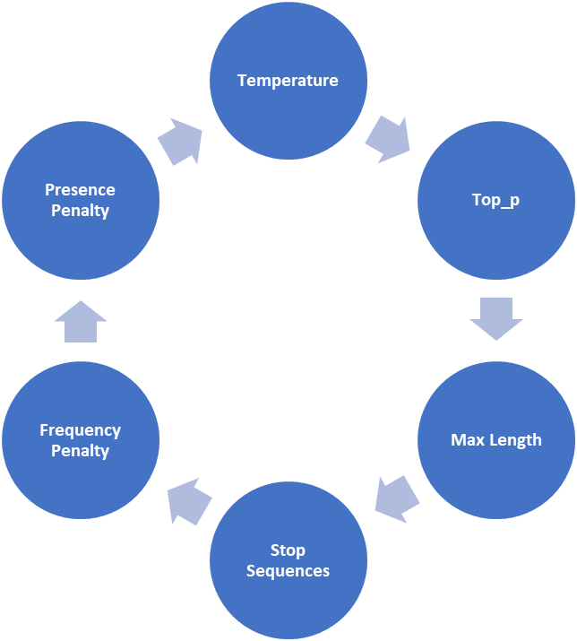

### **Basics of Prompting**
------------------------

* Prompting an LLM
* Prompt Formatting

#### **Prompting an LLM**

- You can achieve a lot with simple prompts, but the quality of results depends on how much information you provide it and how well-crafted the prompt is. A prompt can contain information like the instruction or question you are passing to the model and include other details such as context, inputs, or examples. You can use these elements to instruct the model more effectively to improve the quality of results.

 **Let's get started by going over a basic example of a simple prompt:**

Prompt:

```
The sky is
```

Output:

```
blue.
```

You can observe from the prompt example above that the language model responds with a sequence of tokens that make sense given the context "The sky is". The output might be unexpected or far from the task you want to accomplish. In fact, this basic example highlights the necessity to provide more context or instructions on what specifically you want to achieve with the system. This is what prompt engineering is all about.

**Let's try to improve it a bit:**

Prompt:

```
Complete the sentence: 
The sky is
```

Output:

```
blue during the day and dark at night.
```


 Is that better? Well, with the prompt above you are instructing the model to complete the sentence so the result looks a lot better as it follows exactly what you told it to do ("complete the sentence"). This approach of designing effective prompts to instruct the model to perform a desired task is what's referred to as prompt engineering in this guide.

The example above is a basic illustration of what's possible with LLMs today. Today's LLMs are able to perform all kinds of advanced tasks that range from text summarization to mathematical reasoning to code generation.

#### **Prompt Formatting**

You have tried a very simple prompt above. A standard prompt has the following format:

```
<Question>?
```

or

```
<Instruction>
```


You can format this into a question answering (QA) format, which is standard in a lot of QA datasets, as follows:

```
Q: <Question>?
A: 
```


When prompting like the above, it's also referred to as zero-shot prompting, i.e., you are directly prompting the model for a response without any examples or demonstrations about the task you want it to achieve. Some large language models have the ability to perform zero-shot prompting but it depends on the complexity and knowledge of the task at hand and the tasks the model was trained to perform good on.

**A concrete prompt example is as follows:**

**Prompt**

Q: What is prompt engineering?


With some of the more recent models you can skip the "Q:" part as it is implied and understood by the model as a question answering task based on how the sequence is composed. In other words, the prompt could be simplified as follows:

**Prompt**

What is prompt engineering?


Given the standard format above, one popular and effective technique to prompting is referred to as few-shot prompting where you provide exemplars (i.e., demonstrations). You can format few-shot prompts as follows:

```
<Question>?
<Answer>
<Question>?
<Answer>
<Question>?
<Answer>
<Question>?
```


The QA format version would look like this:

```
Q: <Question>?
A: <Answer>
Q: <Question>?
A: <Answer>
Q: <Question>?
A: <Answer>
Q: <Question>?
A:

```

Keep in mind that it's not required to use the QA format. The prompt format depends on the task at hand. For instance, you can perform a simple classification task and give exemplars that demonstrate the task as follows:

Prompt:

```
This is awesome! // Positive
This is bad! // Negative
Wow that movie was rad! // Positive
What a horrible show! //
```

Output:

```
Negative
```


Few-shot prompts enable in-context learning, which is the ability of language models to learn tasks given a few demonstrations. We discuss zero-shot prompting and few-shot prompting more extensively in upcoming sections.


### **Prompt Elements**
-----------------

A prompt contains any of the following elements:

- **Instruction** - a specific task or instruction you want the model to perform

- **Context** - external information or additional context that can steer the model to better responses

- **Input Data** - the input or question that we are interested to find a response for

- **Output Indicator** - the type or format of the output.

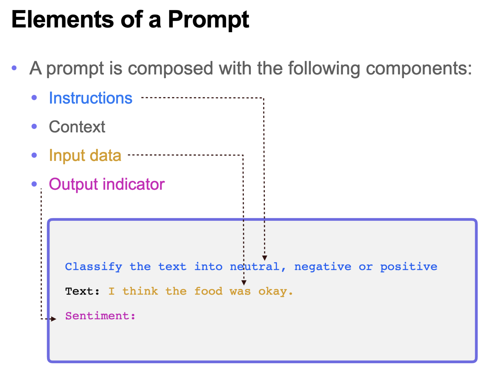


### **General Tips for Designing Prompts**
--------------------------------

- [Be clear and specific](#be-specific-and-clear)
- [Break down the task](#break-down-the-task)
- [Use Input- output examples](#use-input-output-examples)
- [Incorporate context and constraints](#incorporate-context-and-constraints)
- [Discuss approaches and ask for user input](#discuss-approaches-and-ask-for-user-input)
- [Handle Edge cases and errors](#handle-edge-cases-and-errors)
- [Iterative Refinement](#iterative-refinement)

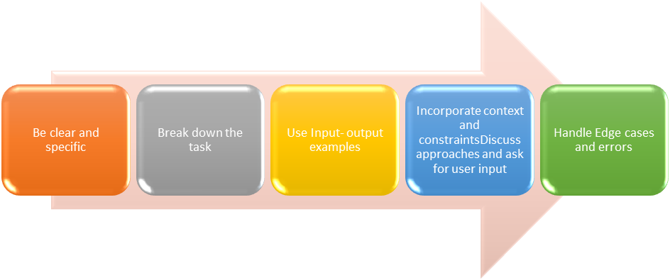

#### **Be Specific and Clear**

Clearly state the task, input, and expected output. Avoid ambiguity in your instructions.

Example:

```
Original Prompt:
Write a Python function that calculates the sum of two numbers.

Improvement:
Write a Python function named 'calculate_sum' that takes two numbers as input and returns their sum.

```

#### **Break Down the Task**

Divide the task into smaller steps and guide the AI through each step.

Example:

```
Original Prompt:
Write a Python function that reverses a string.

Improvement:
Step 1: Define a function named 'reverse_string' that takes a string parameter.
Step 2: Initialize an empty string 'reversed_str'.
Step 3: Iterate through the characters of the input string in reverse order.
Step 4: Append each character to 'reversed_str'.
Step 5: Return 'reversed_str' at the end of the function.

```

#### **Use Input-Output Examples**

Provide examples to illustrate the desired behavior of the code.

Example:

```
Original Prompt:
Write a Python function to find the maximum element in a list.

Improvement:
Write a Python function named 'find_max' that takes a list of numbers as input and returns the largest element.

Example 1:
Input: [3, 7, 2, 9, 5]
Output: 9

Example 2:
Input: [12, 6, 8, 10, 4]
Output: 12

```

#### **Incorporate Context and Constraints**

Include relevant context or constraints for the task.

Example:

```
Original Prompt:
Write a Python program to generate a list of the first 10 prime numbers.

Improvement:
Write a Python program that generates a list of the first 10 prime numbers. You can use the Sieve of Eratosthenes algorithm to efficiently find prime numbers.

```

#### **Discuss Approaches and Ask for User Input**

Engage in a conversation with the AI, discussing possible approaches and asking for its input.

Example:

```
Original Prompt:
Write a Python function to check if a string is a palindrome.

Improvement:
User: Can you help me write a python function to check if a string is a palindrome?
AI: Sure! Do you have any specific ideas on how to approach this?
User: I was thinking of comparing the string with its reverse.
AI: That's a good approach! Let's start by defining the function...

```

#### **Handle Edge Cases and Errors**

Include instructions for handling edge cases and errors.

Example:

```
Original Prompt:
Write a Python function that divides two numbers.

Improvement:
Write a Python function named 'divide_numbers' that takes two numbers as input and returns their quotient. Handle the 'ZeroDivisionError' by returning None if the second number is 0.

```

#### **Iterative Refinement**

Iterate and refine your prompt based on AI responses. If the generated code isn't satisfactory, adjust the prompt to provide clearer guidance.

Example:

```
Original Prompt:
Write a Python function that calculates the factorial of a number.

Improvement:
Step 1: Define a python function named 'calculate_factorial' that takes a positive integer 'n' as input.
Step 2: Handle the case where 'n' is 0 or 1 by directly returning 1.
Step 3: Use a loop to calculate the factorial for 'n' greater than 1.
Step 4: Return the calculated factorial at the end of the function.

```

By applying these tips and continuously refining your prompts based on AI responses, you can guide the model to generate accurate and relevant Python code. 

Remember that prompt engineering is an iterative process, and experimenting with different styles and techniques will help you find the most effective approach for your specific tasks.


### **Techniques**
----------------------

- [Zero-shot Prompting](#Zero-shot-Prompting)
- [Few-shot Prompting](#Few-shot-Prompting)
- [Chain-of-Thought Prompting](#Chain-of-Thought-Prompting)
- [Self-Consistency](#Self-Consistency)
- [Tree of Thoughts](#Tree-of-Thoughts)
- [Automatic Reasoning and Tool](#Automatic-Reasoning-and-Tool)
- [Directional Stimulus/instructional Prompting](#Directional-Stimulus/instructional-Prompting)
- [ReAct](#ReAct)
- [ReBuff](#ReBuff)
- [Multimodal CoT](#Multimodal-CoT)


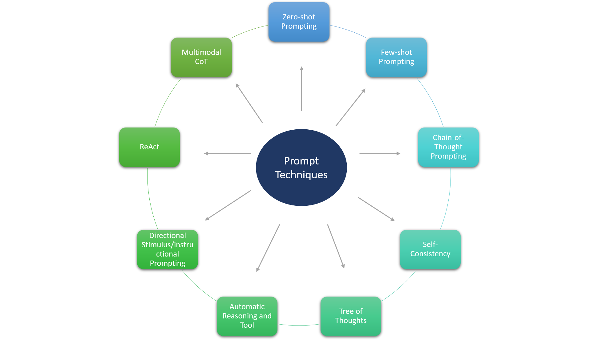

#### **Zero-shot Prompting**

- Zero-shot prompting refers to a technique in natural language processing where a pre trained model is asked to generate text without being provided with any specific examples or prompts during training. Instead, the model is expected to generate coherent responses based on a general understanding of language and the task at hand.

- This technique can be applied to various tasks, such as translation, summarization, question answering, and more. 
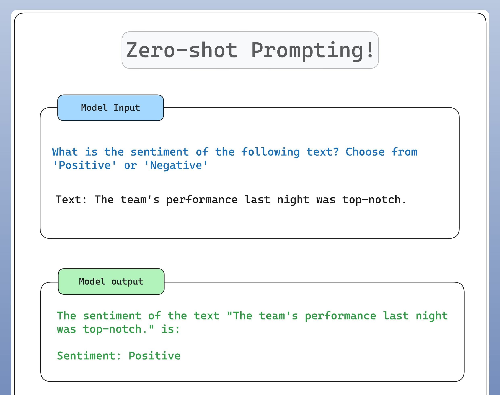

**Example: Using Zero-Shot Prompting for Text Classification**

Prompt:

```

Classify the sentiment of the following text as positive, negative, or neutral: "I just finished reading the book and I'm absolutely thrilled with the ending!"

```

Output:

```
Sentiment: Positive

```

In this example, you provided a single prompt that instructs the model to classify the sentiment of the given text as positive, negative, or neutral. The model, even though not specifically trained for sentiment analysis, is able to generate an appropriate response by leveraging its pre-existing understanding of language and context.

**Key Points**

- `Single Prompt, Multiple Tasks:` Zero-shot prompting allows you to perform multiple tasks with a single prompt, leveraging the model's existing capabilities.

- `Pre-trained Knowledge:` The model's understanding of language and context enables it to generalize its knowledge to tasks it wasn't specifically trained for.

- `Context Matters:` Crafting a well-structured prompt with clear instructions is crucial to guide the model effectively.

- `Not Task-Specific:` The model's responses may not be as specialized as those of task-specific models, but it's a versatile approach.


#### **Few-shot Prompting**

- Few-shot prompting is a technique that builds upon the principles of zero-shot prompting but provides the model `with a few examples` to give it a better understanding of the desired task.

- Few-shot prompting involves utilizing a pre-trained language model to perform tasks with only a small amount of task-specific examples or prompts, rather than a large corpus of training data.

- Instead of relying solely on its pre-existing knowledge, the model is guided by a small number of input-output pairs.

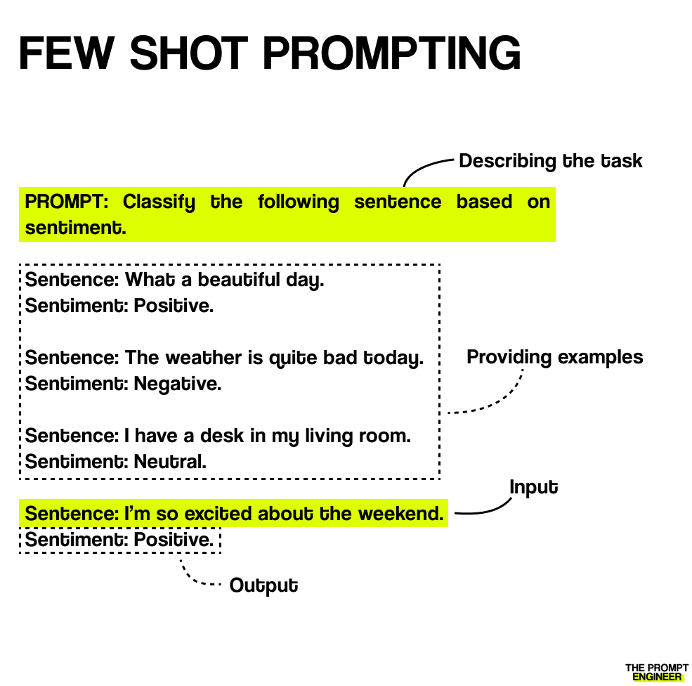

**Example: Using Few-Shot Prompting for Language Translation**

Prompt:

```
Translate the following English sentences into French:
1. Input: "Hello, how are you?"
   Output: "Bonjour, comment ça va ?"

2. Input: "I love learning new languages."
   Output: "J'adore apprendre de nouvelles langues."

3. Input: "Goodbye, see you later!"
   Output: "Au revoir, à plus tard !"

Now, translate the following English text into French: "I'm excited to visit Paris next week."

```

Output:

```
Translation: "Je suis impatient(e) de visiter Paris la semaine prochaine."

```

In this example, you provided a few-shot prompt with three examples of English-French translations. The model uses these examples to generalize the translation task and then translates the given text into French.

 **Key Points**

- `Few Examples:` Few-shot prompting involves providing a small number of examples (shots) to guide the model's understanding of the task.

- `Improved Generalization:` The examples help the model better understand the desired behavior and improve its performance compared to pure zero-shot prompting.

- `Contextual Understanding:` The model learns patterns from the examples and applies them to the given task.

- `Flexible Application:` Few-shot prompting can be used for various tasks, including translation, summarization, question-answering, and more.

- `Balancing Examples:` Providing a few diverse examples helps the model learn the task while avoiding overfitting.


#### **Chain-of-Thought Prompting**

- Chain of thought prompting involves sequentially providing a series of prompts or cues to guide a conversation or narrative generated by a language model. 
- Each prompt builds upon the context and information provided by the previous prompts, allowing for more coherent and focused interactions.

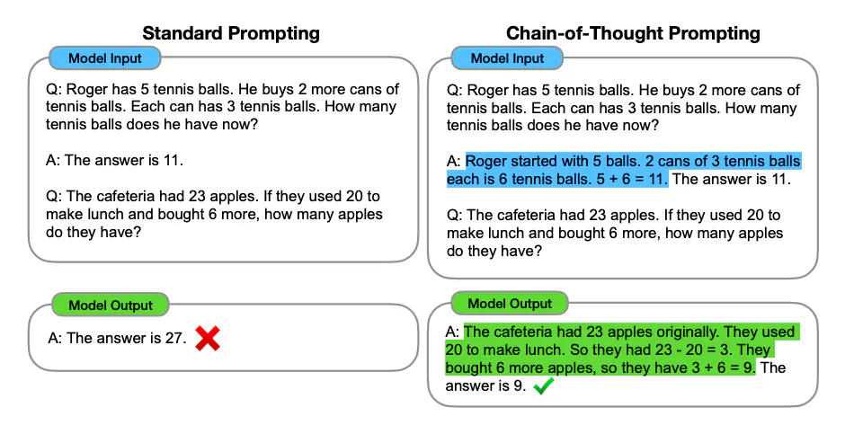

**Example: Generating Python Code for a Calculator**

Prompt:

```
1. User: I need a Python program that performs basic mathematical operations.
2. AI: Sure! Let's start by defining a function named 'calculator'.
3. User: The 'calculator' function should take two numbers as input and allow for addition.
4. AI: Got it. I'll include code for adding the two numbers.
5. User: Additionally, I want the function to support subtraction.
6. AI: Understood. I'll add code for subtracting the second number from the first.
7. User: Great! Now, include functionality for multiplication as well.
8. AI: Sure thing. I'll add code for multiplying the two numbers.
9. User: Finally, I'd like to include division in the 'calculator' function.
10. AI: Absolutely. I'll include code for dividing the first number by the second.

Now, let's generate the complete 'calculator' function that performs addition, subtraction, multiplication, and division.

```

Output:

```
def add(x, y):
    return x + y

def subtract(x, y):
    return x - y

def multiply(x, y):
    return x * y

def divide(x, y):
    if y == 0:
        return "Cannot divide by zero"
    return x / y

def calculator():
    print("Select operation:")
    print("1. Add")
    print("2. Subtract")
    print("3. Multiply")
    print("4. Divide")
    
    choice = input("Enter choice (1/2/3/4): ")
    
    num1 = float(input("Enter first number: "))
    num2 = float(input("Enter second number: "))
    
    if choice == '1':
        result = add(num1, num2)
        print(num1, "+", num2, "=", result)
    elif choice == '2':
        result = subtract(num1, num2)
        print(num1, "-", num2, "=", result)
    elif choice == '3':
        result = multiply(num1, num2)
        print(num1, "*", num2, "=", result)
    elif choice == '4':
        result = divide(num1, num2)
        print(num1, "/", num2, "=", result)
    else:
        print("Invalid input")

calculator()

```

In this example, you used a Chain-of-Thought prompt to guide the AI model through the process of generating a Python program for a calculator. The conversation-like format ensures that the AI follows each step of the task and includes the requested functionality in the final code.

**Key Points**

- `Sequential Interaction:` Chain-of-Thought prompting involves a back-and-forth conversation with the AI to build up the desired output step by step.

- `Contextual Guidance:` Each prompt in the chain provides context and information necessary for the subsequent prompts.

- `Coherent Output:` The technique encourages coherent and structured responses from the AI by breaking down the task into manageable parts.

- `Complex Tasks:` Chain-of-Thought is particularly useful for complex tasks that require multiple steps or components.

- `Iterative Refinement:` You can iteratively refine the prompts in the chain based on the AI's responses to ensure accurate and desired output.


#### **Self-Consistency**

- Self-Consistency Prompting is a technique that involves repeatedly asking an AI model to provide examples or correct its own outputs. 

- By guiding the model to improve its responses based on its own previous answers, you can enhance the accuracy and consistency of generated content.

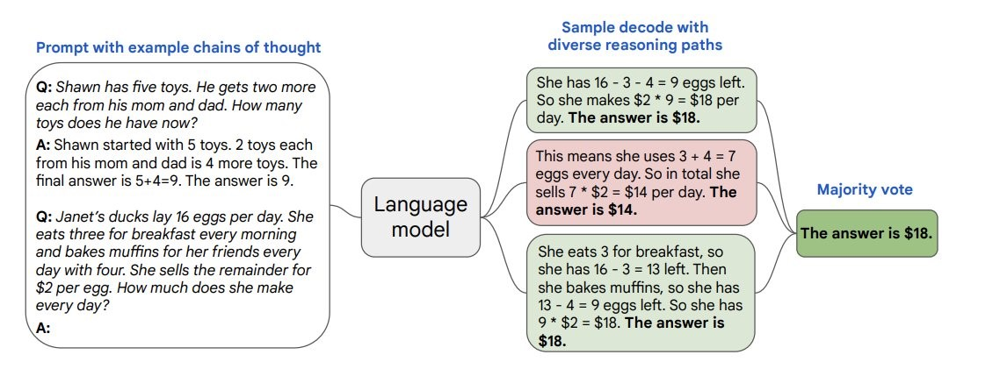

**Example:Generating Python Codefor arithmetic reasoning**

Prompt:

```
Q: There are 15 trees in the grove. Grove workers will plant trees in the grove today. After they are done,
there will be 21 trees. How many trees did the grove workers plant today?
A: We start with 15 trees. Later we have 21 trees. The difference must be the number of trees they planted.
So, they must have planted 21 - 15 = 6 trees. The answer is 6.
Q: If there are 3 cars in the parking lot and 2 more cars arrive, how many cars are in the parking lot?
A: There are 3 cars in the parking lot already. 2 more arrive. Now there are 3 + 2 = 5 cars. The answer is 5.
Q: Leah had 32 chocolates and her sister had 42. If they ate 35, how many pieces do they have left in total?
A: Leah had 32 chocolates and Leah’s sister had 42. That means there were originally 32 + 42 = 74
chocolates. 35 have been eaten. So in total they still have 74 - 35 = 39 chocolates. The answer is 39.
Q: Jason had 20 lollipops. He gave Denny some lollipops. Now Jason has 12 lollipops. How many lollipops
did Jason give to Denny?
A: Jason had 20 lollipops. Since he only has 12 now, he must have given the rest to Denny. The number of
lollipops he has given to Denny must have been 20 - 12 = 8 lollipops. The answer is 8.
Q: Shawn has five toys. For Christmas, he got two toys each from his mom and dad. How many toys does
he have now?
A: He has 5 toys. He got 2 from mom, so after that he has 5 + 2 = 7 toys. Then he got 2 more from dad, so
in total he has 7 + 2 = 9 toys. The answer is 9.
Q: There were nine computers in the server room. Five more computers were installed each day, from
monday to thursday. How many computers are now in the server room?
A: There are 4 days from monday to thursday. 5 computers were added each day. That means in total 4 * 5 =
20 computers were added. There were 9 computers in the beginning, so now there are 9 + 20 = 29 computers.
The answer is 29.
Q: Michael had 58 golf balls. On tuesday, he lost 23 golf balls. On wednesday, he lost 2 more. How many
golf balls did he have at the end of wednesday?
A: Michael initially had 58 balls. He lost 23 on Tuesday, so after that he has 58 - 23 = 35 balls. On
Wednesday he lost 2 more so now he has 35 - 2 = 33 balls. The answer is 33.
Q: Olivia has $23. She bought five bagels for $3 each. How much money does she have left?
A: She bought 5 bagels for $3 each. This means she spent $15. She has $8 left.
Q: When I was 6 my sister was half my age. Now I’m 70 how old is my sister?
A:

```
Output 1:

```
When I was 6 my sister was half my age, so she was 3. Now I am 70, so she is 70 - 3 = 67. The answer is 67.
```

Output 2:

```
When the narrator was 6, his sister was half his age, which is 3. Now that the narrator is 70, his sister would be 70 - 3 = 67 years old. The answer is 67.
```

Output 3:

```
When I was 6 my sister was half my age, so she was 3. Now I am 70, so she is 70/2 = 35. The answer is 35.
```

Computing for the final answer involves a few steps (check out the paper for the details) but for the sake of simplicity, we can see that there is already a majority answer emerging so that would essentially become the final answer.

**Key points**

- `Iterative Refinement:` Self-Consistency Prompting involves guiding the model through multiple steps while having it refine its own responses based on earlier instructions.

- `Accurate Outputs:` By correcting itself, the AI generates more accurate and consistent code.

- `Contextual Understanding:` The AI uses its previous responses to ensure consistency and coherence in the final output.

- `Feedback Loop:` The technique creates a feedback loop where the AI learns from its own outputs to improve over iterations.

- `Enhanced Control: `Self-Consistency Prompting gives you greater control over the generated content by directing the model's corrections.

#### **Tree of Thoughts**

- Tree of thoughts(ToT) involves structuring prompts in a hierarchical manner to guide a language model's generation of responses along multiple branches or paths of thought.

- Each prompt serves as a node in the tree, branching out into different directions or topics, allowing the model to explore and generate text along various thematic pathways.

- This technique enables the generation of rich and diverse narratives or conversations by providing the model with structured guidance on different aspects or subtopics to explore.

- This technique is particularly useful for complex tasks that require multiple layers of guidance.

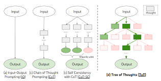

**Example: Using Tree of Thoughts for Developing a Python Game**

Suppose you want to use a language model to help you develop a simple text-based Python game. You can use the Tree of Thoughts technique to outline the different components and interactions of the game.

Tree of Thoughts Outline:

```
1. User: I want to create a text-based Python game.
    1.1. AI: Great! Let's start by defining the game's main loop.
        1.1.1. User: The game loop should display a welcome message and menu options.
            1.1.1.1. AI: Understood. I'll include code to display the welcome message and menu.
        1.1.2. User: The player should be able to choose from multiple game options.
            1.1.2.1. AI: I'll add code to handle player input and execute the chosen game option.
    1.2. AI: Now, let's focus on creating one of the game options - a number guessing game.
        1.2.1. User: The player should guess a random number within a specified range.
            1.2.1.1. AI: I'll write code to generate a random number and prompt the player for a guess.
        1.2.2. User: Provide feedback if the guess is too high or too low.
            1.2.2.1. AI: I'll include conditional statements to provide appropriate feedback.
        1.2.3. User: The player should have a limited number of attempts.
            1.2.3.1. AI: I'll add a loop to track the number of attempts and limit them.
        1.2.4. User: Display a win or lose message based on the player's guess.
            1.2.4.1. AI: I'll write code to display the outcome message.
    1.3. AI: Excellent! We've built a number guessing game. Do you want to add more game options?
        1.3.1. User: Yes, let's add a word guessing game.
            1.3.1.1. AI: Sure. I'll guide you through creating the word guessing game.
        1.3.2. User: No, I'm satisfied with the current game options.
    1.4. AI: Perfect! Your text-based Python game is ready to be played.

```
In this example, you used the Tree of Thoughts technique to guide the AI model through the process of developing a text-based Python game. The structured outline ensures that each component of the game is thoroughly discussed and implemented, resulting in a coherent and functional game.

**Key Points**

- `Structured Guidance:` The Tree of Thoughts technique provides a structured and organized way to guide the AI's responses.

- `Layered Approach:` Each layer of the tree represents a step in the conversation, helping to break down complex tasks.

- `Progressive Detail:` The branching paths allow for progressive elaboration of the task, leading to a comprehensive solution.

- `Modular Design:` The technique encourages a modular design approach, making it easier to manage and develop complex projects.

- `Interactive Development:` The back-and-forth interaction resembles a collaborative development process, ensuring key components are covered.


#### **Automatic Reasoning and Tool**

- Automatic Reasoning and Tool-use (ART) prompting involves formulating prompts in a manner that encourages a language model to demonstrate abilities related to logical reasoning and tool usage without explicit training on these tasks.

- The prompts are designed to assess the model's capability to understand and apply logical rules, perform problem-solving tasks, and utilize external resources or tools to achieve a given objective. 

- ART prompting aims to evaluate the model's capacity for abstract reasoning and practical problem-solving skills in various domains.


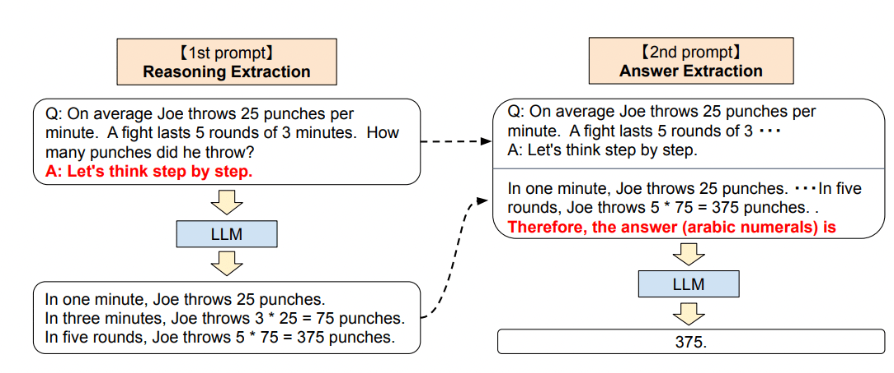

**Example: Using ART for Debugging Python Code**

Suppose you have a piece of Python code that is not working as expected, and you want to use the ART technique to guide the AI model to debug the code.

Prompt:

```
Debug the following Python code that is intended to calculate the factorial of a given positive integer.

Code Snippet:

def factorial(n):
if n == 0:
return 1
else:
return n * factorial(n - 2)

```

Output:

```
The provided code snippet attempts to calculate the factorial of a given positive integer. However, it seems to have an issue in the recursive call, where it subtracts 2 from the current n value. It should subtract 1 instead. Here's the corrected code:

def factorial(n):
    if n == 0:
        return 1
    else:
        return n * factorial(n - 1)

In the corrected code, the recursive call to factorial subtracts 1 from the current n value instead of subtracting 2. This ensures that the recursion progresses in the correct way, calculating the factorial of the given positive integer.

```

In this example, you used the ART technique to instruct the AI model to analyze and debug the given Python code. The AI combined its reasoning abilities with its knowledge of correct factorial calculation to identify and explain the error in the code.


**Key Points**

- `Combining Reasoning and Tools:` The ART technique leverages the AI's general reasoning skills and specific tool knowledge to solve problems.

- `Problem-Specific Knowledge:` The AI uses its understanding of programming concepts and logic to identify issues and provide solutions.

- `Tool Usage:` The AI can apply its knowledge of debugging techniques and best practices to provide actionable suggestions.

- `Complex Problem Solving:` ART is particularly useful for complex tasks that require both general problem-solving abilities and specialized knowledge.

- `Educational Value:` This technique can provide insights into debugging processes and improve programming skills.

#### **Directional Stimulus/instructional Prompting**

- Directional Stimulus Prompting is a technique where you provide a stimulus or input that guides the AI's response in a specific direction. 

- This technique can be useful for steering the AI's focus and encouraging it to generate desired outcomes.


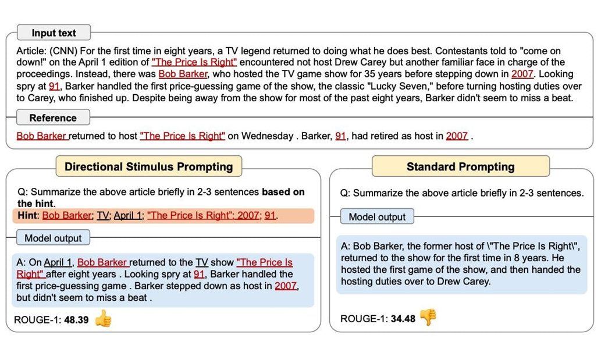

**Example: Using Directional Stimulus for Python Code Optimization**

Suppose you have a Python code snippet and you want to use Directional Stimulus Prompting to guide the AI model to optimize the code for better performance.

Prompt:

```
Optimize the following Python code snippet for calculating the sum of even numbers in a list.

Original Code Snippet:

def sum_even_numbers(numbers):
total = 0
for num in numbers:
if num % 2 == 0:
total += num
return total

```

AI's Response:

```

Optimized Code Explanation:
To optimize the code for calculating the sum of even numbers, you can eliminate the loop and directly calculate the sum using list comprehension. Here's the optimized code:

Optimized Code Snippet:

def sum_even_numbers(numbers):
return sum(num for num in numbers if num % 2 == 0)

```
In this example, you used Directional Stimulus Prompting to guide the AI model toward optimizing the given Python code snippet. The prompt explicitly directed the AI's attention to optimizing the code, resulting in a more concise and efficient solution.

**Key Points**

- `Focused Guidance:` Directional Stimulus Prompting provides specific direction to the AI, helping it generate targeted responses.

- `Desired Outcome:` The technique encourages the AI to focus on a particular aspect or goal in the generated content.

- `Optimization and Improvements:` Directional prompts can guide the AI to make improvements, optimizations, or modifications to code or other content.

- `Task Alignment:` The prompt aligns the AI's response with a particular purpose or intent, ensuring that the generated content meets your specific requirements.

- `Precision and Control:` This technique gives you greater control over the AI's output, ensuring it generates content that aligns with your objectives.

#### **ReAct Prompting**

- The React Prompting technique involves having a back-and-forth interaction with the AI model, where you provide feedback or react to its responses. 

- This technique allows you to guide the AI's output through iterative refinement based on your reactions. 


**Example: Using React Prompting for Python Function Enhancement**

Suppose you want to use the React Prompting technique to enhance a Python function you've received from the AI model.

Prompt:

```
Generate a Python function that calculates the sum of all even numbers in a list. Please make sure the function is efficient and handles empty lists.

```

AI-generated Code:

```
def sum_even_numbers(numbers):
total = 0
for num in numbers:
if num % 2 == 0:
total += num
return total

```

**User's reaction prompt:**

```
The generated code looks good, but it might be more efficient to use a generator expression and the 'sum()' function. Also, let's add a condition to handle empty lists by returning 0.

```
**AI's Enhanced Code:**

```
def sum_even_numbers(numbers):
if not numbers:
return 0
return sum(num for num in numbers if num % 2 == 0)

```

**Key Points**

- `Iterative Refinement:` React Prompting involves an iterative process where you provide feedback, and the AI reacts to your suggestions to improve its output.

`Interactive Collaboration:` This technique simulates a collaborative interaction, allowing you to guide the AI's output based on your expertise.

`Enhancement and Adjustments:` React prompting is useful for making improvements, adjustments, or refinements to the AI-generated content.

`Feedback Loop:` The back-and-forth interaction ensures that the generated content aligns with your expectations and requirements.

`Fine-Tuning and Customization:` React prompting enables you to fine-tune the AI's responses to suit your specific needs.

#### **Multimodal CoT Prompting**

- The Multimodal Chain-of-Thought (CoT) Prompting technique extends the traditional CoT approach by allowing the integration of both text and images to guide the AI's responses. 

- This technique is particularly useful for tasks that involve a combination of textual and visual information.

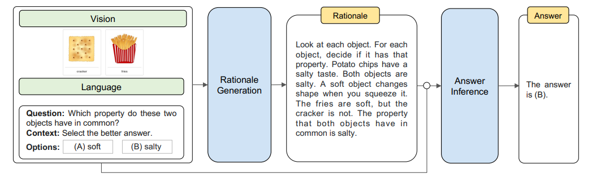

**Example: Using Multimodal CoT for Image Captioning with Python Code**

Suppose you want to use the Multimodal CoT Prompting technique to guide the AI model in generating a Python code snippet to perform image captioning.

**Multimodal CoT Outline:**

```
1. User: I need a Python code snippet that performs image captioning.
    1.1. AI: Certainly! Let's start by loading a pre-trained image captioning model.
    1.2. User: The model should use a transformer architecture and be able to generate descriptive captions.
        1.2.1. AI: I'll include code to load a transformer-based image captioning model.
    1.3. User: Provide instructions for preprocessing the input image.
        1.3.1. AI: I'll guide you through image preprocessing using libraries like PIL and torchvision.
    1.4. User: Now, let's generate a caption for a sample image.
        1.4.1. AI: Sure. I'll demonstrate how to use the model to generate a caption for a given image.
    1.5. User: Incorporate the generated caption into a Flask web application that accepts image uploads.
        1.5.1. AI: I'll guide you through setting up a Flask app to accept image uploads, process them, and display the captions.

Now, let's generate the complete Python code for the image captioning Flask app.

```

In this example, you used the Multimodal CoT Prompting technique to guide the AI model through the process of generating a Python code snippet for an image captioning Flask web application. The structured outline ensures that both textual instructions and visual concepts are integrated to achieve the desired outcome.

**Key Points**

- `Text and Image Integration:` Multimodal CoT Prompting combines both textual prompts and visual concepts to guide the AI's responses.

- `Guided Multimodal Development:` This technique is ideal for tasks that involve both textual and visual components, such as image processing and analysis.

- `Structured Guidance:` The outlined conversation guides the AI model step by step through a complex task involving multiple modalities.

- `Enhanced Understanding:` Multimodal CoT ensures that the AI understands the interplay between textual and visual aspects of the task.

- `Comprehensive Output:` The generated content integrates both code and explanations, resulting in a complete solution.
